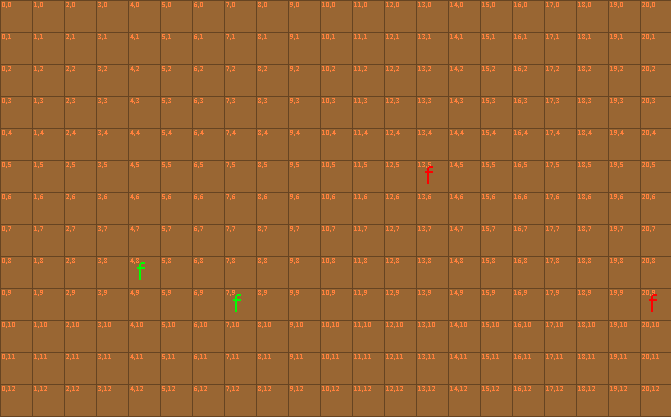

# Reinforcement Learning and Genetic Algorithms

This project is an experimental dive into machine learning to create an agent for the SEPIA environment.
[SEPIA](https://github.com/timernsberger/sepia) (Strategy Engine for Programming Intelligent Agents) is a Java environment given to those in CWRU's CSDS 391 (Intro to AI) course.
Agents in this environment control units which can perform tasks such as gathering resources, building buildings, and fighting. I have chosen to focus on the combat aspect as I find it the most exciting.

This project uses gRPC to allow the neural network code (written in Python) to communicate with SEPIA (written in Java).

Implementation is heavily inspired by the [paper](https://arxiv.org/abs/1912.06680) written by OpenAI on their DOTA 2 bot,
a reinforcement learning algorithm that learns to play the video game DOTA 2. 

## Table of Contents
* [Reinforcement Learning and Genetic Algorithms](#reinforcement-learning-and-genetic-algorithms)
    * [SEPIA](#sepia)
    * [Methods](#methods)
      * [Genetic Algorithms](#genetic-algorithms)
      * [Reinforcement Learning](#reinforcement-learning)
    * [Genetic Algorithm Implementation](#genetic-algorithm-implementation)
      * [Network architecture](#network-architecture)
      * [Observation space](#observation-space)
      * [Action space](#action-space)
      * [Fitness](#fitness)
      * [Results](#results)
    * [Reinforcement Learning Implementation](#reinforcement-learning-implementation)

## SEPIA

The SEPIA environment consists of a grid of squares that can be occupied by a unit, a resource, or be empty.
Units can move, gather resources, build buildings, and attack other units. Each unit can carry a different amount of resources,
has a different attack range, attack damage, and health. Resources consist of gold and wood. These can be used to construct new buildings,
and gold can be used to make more units.

The game is turn based, one player does their actions, then the other. Every unit on a team can do one action per timestep.
Actions can be configured to take more than one time step, it this setup, every actions takes only one step.

The game can be configured to have different end states. For example, when a certain amount of gold has been collected,
or when all the units on a team have been killed.

When the Fog of War is on, units can only "see" a certain distance. When it is off, all units have perfect information
of the game state. By default, the Fog of War is off. 

The following picture shows an example SEPIA game state. The green units are on Team 0, and the red units are on Team 1.
The "f" stands for Footman, a simple unit with an attack range of 1 square.

## Methods

I have looked into two machine learning methods for this project. These were genetic algorithms and Reinforcement learning.

#### Genetic Algorithms

This was the first method investigated. A genetic algorithm (GA) works on a population of agents.
Agents use a neural network to observe their environment at each time step and choose an action to take.
Agents are then run in the environment and those with higher fitness (a measure of success) are selected to reproduce.
Reproduction consists of taking two agents and combining parts of their neural networks together to produce a child.
The child is then randomly mutated. Over time, the fitness of the population increases.

Due to the large observation space and random nature of the algorithm, these agents quickly hit a skill ceiling.
I abandoned the genetic algorithm in favor of reinforcement learning. 

#### Reinforcement Learning

In reinforcement learning (RL), the agent observes its environment each time step and produces an action.
It then receives a reward or penalty for the action. For example, in combat, killing an enemy unit would have a high reward.
Over time, the agent learns to maximize the expected rewards by choosing the best actions. There are different methods of
implementing an observation->actions policy for RL agents. Two common ones are a lookup table (known as a Q table) or a
neural network.

## Genetic Algorithm Implementation

As the GA was the first method investigated, gRPC was not integrated into the project yet. Thus, instead of being able to use python's
many machine learning packages, a very basic neural network implementation was written from scratch in Java.
There were only three different layer types, a Dense layer, Recurrent layer, and LSTM layer.

An agent in SEPIA controls the entire team of units. Each unit, has a copy of the neural network that is being evolved.
Units will take different actions because each unit observes different the world relative to where they are.

#### Network architecture

The brain of an agent consisted of a 3 layer neural network: two recurrent layers of size 16 followed by a fully connected (dense)
layer of size 16.

#### Observation space

The inputs to this network consist of: The unit's current health, then, for every friendly unit, the x and y
displacement to us, and their health. And the same for enemy units. This gives an input size of 10, when playing a 2v2 match.

#### Action space

The action space is 8. The action taken is the output neuron with the highest value. The action space is: move north, south,
east, or west, or attack one of the enemy units. If no neuron has an activation of > 0.5, no action is taken.

#### Fitness

Fitness was based on average distance to the enemy (to encourage encounters where damage could be dealt), amount of damage dealt,
and amount of enemy units killed.

#### Results

A population size of around 400 was used, and training for 500 epochs would take around 3 minutes.
However, agents were usually only able to kill only one of the enemy units, no more. It was at this time that development
pivoted to reinforcement learning. Thus, the rest of this paper shall discuss the reinforcement learning implementation.

## Reinforcement Learning Implementation

A few RL algorithms were tried. Details are listed below. 

### Q Table Agent

The first agent created was an agent that used a Q table. A Q Table stores the learned utility of every state action pair.
An optimal agent then simply takes the action with the maximum utility in the current state. This agent was tried first
for its simplicity, however the number of discrete states increases exponentially with the complexity of the environment,
making the Q table agent usable only in the smallest of base cases.

##### Observation Space

The Q table agent plays only in 2 vs 2 matches. The state consists of 6 numbers, these are, the relative x and y coordinates
to our fellow friendly agent and the two enemy agents. However, on a 19x13 board, there are ~(19*13) ^ 3 discrete states,
or 15,000,000. Thus, units can only see the exact position of another unit in a 5x5 grid around them, or, if the other unit
is not in that grid, a value stating which direction the unit is in. This reduces the state size to ~28^3 = 22,000.

### gRPC Implementation

gRPC is used to allow SEPIA, a Java program, to communicate with the control code, in Python.
Currently, the gRPC server is in Python, and custom Java code that interfaces with SEPIA is the client.
This may seem backwards, as SEPIA is where the environment is actually located.
However, attempts to implement the server in Java and client in Python ran into issues
with synchronizing, as SEPIA runs on a separate timer and did not wait for the Python client to make requests.

The gRPC service is very simple. A message is sent to the control code containing the current state of
the SEPIA environment, and the response contains the actions each unit should perform.
During self play, both agents in the environment interact with the same Python server. The Python code
differentiates between requests using the player_id field. 

